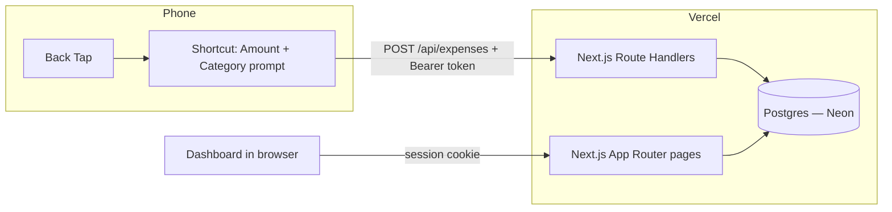
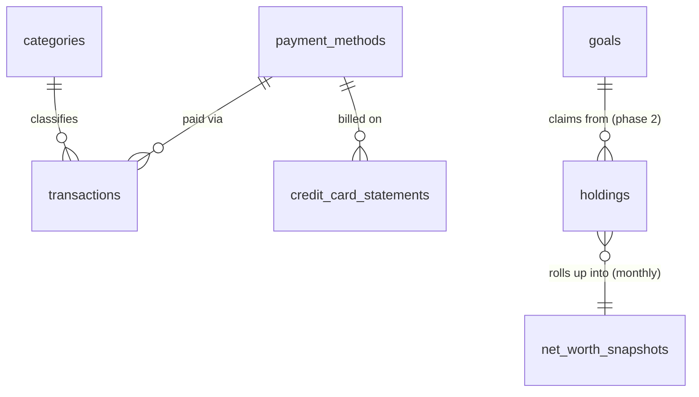

# Dhanos — System Design

*An open-source, self-hostable personal finance OS — track expenses via a phone back-tap, watch your net worth grow, without handing your money data to anyone else's server.*

A single-user personal finance admin panel replacing a 48-month Google Sheet, with Apple Shortcuts (Back Tap) as the primary capture channel.

## 1. Goals

- Replace two Google Sheet modules — monthly cashflow and net worth — with one app.
- Log an expense in under 10 seconds via a phone back-tap, no unlocking or app-opening required.
- Preserve the sheet's existing mental model (Fixed/Variable, credit card cycles, asset-class net worth) rather than inventing a new one.
- Single deploy, single service: Next.js on Vercel, nothing else to operate.

**Non-goals (v1):** multi-user support, bank/broker sync, budgeting alerts, goal planning (phase 2).

## 2. Architecture



One Next.js app serves both the dashboard (session-authenticated) and the API (token-authenticated). No separate backend, no queue, no background jobs — every write is synchronous and small.

## 3. Tech Stack

| Layer | Choice | Why |
| --- | --- | --- |
| Framework | Next.js (App Router) | Frontend + backend in one deploy, matches existing stack |
| DB | Postgres (Neon or Vercel Postgres) | Serverless-connection-friendly; relational fits the ledger + snapshot model |
| ORM | Drizzle | Lightweight, plain SQL-shaped, no edge-runtime friction |
| Styling | Tailwind | Already decided |
| Validation | Zod | One schema shared between dashboard form and `/api/expenses` |
| Dashboard auth | Signed session cookie (single user, no provider needed) | No multi-tenant complexity to justify Auth.js |
| Shortcut auth | Static bearer token, hashed at rest | Shortcuts can't do interactive login flows |
| Charts | Recharts | Matches sheet's bar/line charts |

## 4. Data Model

Full schema already drafted (`schema.ts`) — summarized here:



Key decisions (recap, since these drive the API shape):

- **Fixed/Variable** lives on `categories.type`, not per-transaction.
- **Income** is a `transactions` row with `flow = 'income'`, not a hand-typed monthly figure — monthly income becomes `SUM(amount) WHERE flow='income'`.
- **Credit card cycle spend** is stored per `cycleMonth`, not purely derived, because billing cycles don't align to calendar months.
- **Net worth snapshots** are frozen monthly rows, independent of current `holdings` values, so history doesn't drift when a holding is corrected later.

## 5. API Design

All routes under `app/api/`. Two auth modes, never mixed:

| Route | Method | Auth | Purpose |
| --- | --- | --- | --- |
| `/api/expenses` | POST | Bearer token | Shortcut's quick-add target |
| `/api/expenses` | GET | Session | Dashboard ledger fetch (filters via query params) |
| `/api/expenses/:id` | PATCH / DELETE | Session | Edit/delete a transaction |
| `/api/categories` | GET/POST | Session | Manage category list |
| `/api/payment-methods` | GET/POST | Session | Manage UPI/cash/cards |
| `/api/cards/:id/statements` | GET/POST | Session | Log a statement cycle |
| `/api/holdings` | GET/PATCH | Session | Update a holding's current amount |
| `/api/net-worth/snapshot` | POST | Session | Freeze current holdings into a monthly snapshot |
| `/api/tokens` | GET/POST/DELETE | Session | Issue/revoke Shortcut tokens |

`POST /api/expenses` request body (what the Shortcut sends):

```json
{
  "amount": 250,
  "category": "Grocery",
  "note": "Zepto",
  "paymentMethod": "UPI"
}
```

Server resolves `category`/`paymentMethod` by name to their IDs, defaults `date` to today and `flow` to `expense`, validates with the shared Zod schema, inserts, returns `201`.

## 6. Apple Shortcuts Flow

1. Settings → Accessibility → Touch → Back Tap → Double Tap → assign Shortcut.
2. Shortcut: "Ask for Input" (Number) → "Choose from Menu" (categories, hardcoded or pulled once via a GET) → "Get Contents of URL" set to POST, JSON body from the two prior steps, header `Authorization: Bearer <token>`.
3. Token is generated once from `/settings`, pasted into the Shortcut, never rotated unless compromised.
4. Failure handling: if the POST fails (offline, bad token), Shortcut shows a native alert — no retry queue in v1, logged manually if missed.

## 7. Pages

| Route | Purpose |
| --- | --- |
| `/` | Monthly dashboard — income/fixed/variable/savings, credit/debit split, category chart |
| `/transactions` | Filterable ledger, inline edit |
| `/cards` | Per-card cycle spend, statement, paid date, rewards |
| `/net-worth` | Holdings by asset class + growth trend |
| `/goals` | Phase 2 |
| `/settings` | Categories, payment methods, cards, API tokens, CSV import |
| `/login` | Session auth |

## 8. Migration

One-time CSV importer under `/settings`: upload a monthly sheet export, map columns (Date → date, Expenses → description, Amount → amount, Category → category name, Spent W/ → flow/kind, Bank → payment method name), preview parsed rows, confirm insert. Categories/payment methods not yet in the DB are created on the fly during import rather than blocking it.

## 9. Open Source / Self-Hosting

Each self-hoster runs their own deploy, so the app stays single-user per instance — no multi-tenancy needed. What does change:

- **First-run setup flow** — on first load, if no admin user exists, show a setup screen to create one, instead of baking credentials into an env var.
- **Currency/locale as a setting** — stored in a `settings` table, defaults to INR, editable in `/settings`, not hardcoded ₹ in the UI.
- **Generic seed data** — a sensible default category/payment-method list, fully editable/deletable, not personal categories baked into a migration.
- **`.env.example` + README** with a "Deploy to Vercel" button; Neon's Vercel integration can provision the Postgres DB as part of that same flow.
- **License: MIT**, recommended default — simpler and more inviting for a personal-scale tool. AGPL is the alternative only if preventing someone from re-hosting it as a paid SaaS without contributing back matters; Firefly III uses AGPL for that reason.
- **Rate-limit `/api/expenses`** — a leaked or guessed token is a more realistic risk once the code and setup docs are public.

## 10. Open Questions

- Does income get logged retroactively for all 48 months during migration, or only going forward?
- Should the Shortcut's category menu be static (fast, but needs manual updates when categories change) or fetched live via GET on each run (always current, one extra network hop)?
- Net worth snapshot: manual "freeze this month" button, or a scheduled function that runs automatically on the 1st?
- MIT vs AGPL — confirm the license call above before the first public commit.